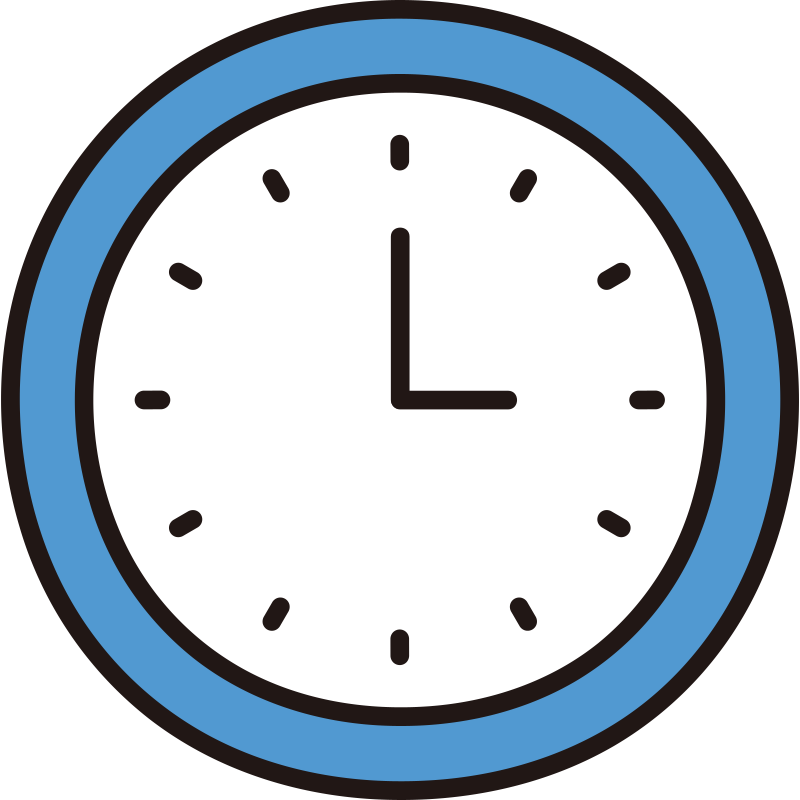

DISCLAIMER
THE SOFTWARE IS PROVIDED "AS IS", WITHOUT WARRANTY OF ANY KIND, EXPRESS OR IMPLIED, INCLUDING BUT NOT LIMITED TO THE WARRANTIES OF MERCHANTABILITY, FITNESS FOR A PARTICULAR PURPOSE AND NONINFRINGEMENT. IN NO EVENT SHALL THE AUTHORS OR COPYRIGHT HOLDERS BE LIABLE FOR ANY CLAIM, DAMAGES OR OTHER LIABILITY, WHETHER IN AN ACTION OF CONTRACT, TORT OR OTHERWISE, ARISING FROM, OUT OF OR IN CONNECTION WITH THE SOFTWARE OR THE USE OR OTHER DEALINGS IN THE SOFTWARE.

<a name="readme-top"></a>

[![Contributors][contributors-shield]][contributors-url]
[![Forks][forks-shield]][forks-url]
[![Stargazers][stars-shield]][stars-url]
[![Issues][issues-shield]][issues-url]
[![MIT License][license-shield]][license-url]
[![LinkedIn][linkedin-shield]][linkedin-url]

<!-- PROJECT LOGO -->
<br />
<div align="center">
  <a href="https://github.com/JPLACLAU/WakeUpContract">
    
  </a>

  <h3 align="center">Wake UP Contract</h3>

  <p align="center">
    An awesome Solidity Smart Contract to force yourself to wake up!
    <br />
    <a href="https://github.com/JPLACLAU/WakeUpContract"><strong>Explore the docs »</strong></a>
    <br />
    <br />
    <a href="https://github.com/JPLACLAU/WakeUpContract">View Demo</a>
    ·
    <a href="https://github.com/JPLACLAU/WakeUpContract/issues">Report Bug</a>
    ·
    <a href="https://github.com/JPLACLAU/WakeUpContract/issues">Request Feature</a>
  </p>
</div>

<!-- TABLE OF CONTENTS -->
<details>
  <summary>Table of Contents</summary>
  <ol>
    <li>
      <a href="#about-the-project">About The Project</a>
      <ul>
        <li><a href="#built-with">Built With</a></li>
      </ul>
    </li>
    <li>
      <a href="#getting-started">Getting Started</a>
      <ul>
        <li><a href="#prerequisites">Prerequisites</a></li>
        <li><a href="#installation">Installation</a></li>
      </ul>
    </li>
    <li><a href="#usage">Usage</a></li>
    <li><a href="#roadmap">Roadmap</a></li>
    <li><a href="#contributing">Contributing</a></li>
    <li><a href="#license">License</a></li>
    <li><a href="#contact">Contact</a></li>
    <li><a href="#acknowledgments">Acknowledgments</a></li>
  </ol>
</details>

<!-- ABOUT THE PROJECT -->

## About The Project

  <a href="https://github.com/JPLACLAU/WakeUpContract">
    
  </a>

This is a project regarding a SmartContract and a Front End web GUI to use as a bet against onself to be able to wake up early in the morning. It is going to be the most used motivational and self improvement SmartContract for waking up early used by the masses of new modern human beings born in the web3 golden era of the future.

Here's why:

- Your time is the most important thing in your life. You cannot buy time.
- You shouldn't be waking up late and be a lazy hooman. You'v got to have your S. together and wake up early to do lots of stuff.
- Using a Smart Contract to help you with this is pure fun.

This project is in an early stage.
Be very careful if you use this code for any purposes, I advise against it.

<p align="right">(<a href="#readme-top">back to top</a>)</p>

### Built With

Built with these frameworks/libraries, add-ons/plugins will be added later

- [![React][react.js]][react-url]
- [![Solidity][soliditylang.org]][soliditylang-url]

<p align="right">(<a href="#readme-top">back to top</a>)</p>

<!-- GETTING STARTED -->

## Getting Started

Instructions will come when Testnet v1.0 is ready.

### Prerequisites

There will be a list of things you need to use this amazing Smart Contract.

- npm

  ```sh
  npm nothing here yet
  ```

### Installation

_Example on how to install/use will come in the future..._

1. Goto [https://github.com/JPLACLAU/WakeUpContract](https://github.com/JPLACLAU/WakeUpContract)
2. Clone the repo

   ```sh
   git clone https://github.com/JPLACLAU/WakeUpContract
   ```

3. Coming soon...
   ```sh
   Coming soon...
   ```

<p align="right">(<a href="#readme-top">back to top</a>)</p>

<!-- USAGE EXAMPLES -->

## Usage

You should not use this app at this moment.

_For more examples, please refer to the [Documentation](https://github.com/JPLACLAU/WakeUpContract)_

<p align="right">(<a href="#readme-top">back to top</a>)</p>

<!-- ROADMAP -->

## Roadmap

- [x] Start the proyect
- [ ] Single person usage with no check on wake up time. "Trust the user"
- [ ] Single person usage with a check time.
- [ ] Add additional stuff
- [ ] Make the front-end beautiful.
- [ ] Multi-language Support
  - [ ] French
  - [ ] Spanish
- [ ] Add moar stuff

See the [open issues](https://github.com/JPLACLAU/WakeUpContract/issues) for a full list of proposed features (and known issues).

<p align="right">(<a href="#readme-top">back to top</a>)</p>

<!-- CONTRIBUTING -->

## Contributing

Contributions are what make the open source community such an amazing place to learn, inspire, and create. Any contributions you make are **greatly appreciated**.

If you have a suggestion that would make this better, please fork the repo and create a pull request. You can also simply open an issue with the tag "enhancement".
Don't forget to give the project a star! Thanks again!

1. Fork the Project
2. Create your Feature Branch (`git checkout -b feature/AmazingFeature`)
3. Commit your Changes (`git commit -m 'Add some AmazingFeature'`)
4. Push to the Branch (`git push origin feature/AmazingFeature`)
5. Open a Pull Request

<p align="right">(<a href="#readme-top">back to top</a>)</p>

<!-- LICENSE -->

## License

Distributed under the MIT License. See `LICENSE.txt` for more information.

<p align="right">(<a href="#readme-top">back to top</a>)</p>

<!-- CONTACT -->

## Contact

Jean-Paul Laclau - [@jplaclau](https://www.linkedin.com/in/jplaclau/) -

Project Link: [https://github.com/JPLACLAU/WakeUpContract](https://github.com/JPLACLAU/WakeUpContract)

<p align="right">(<a href="#readme-top">back to top</a>)</p>

<!-- ACKNOWLEDGMENTS -->

## Acknowledgments

Thank you so much to.. no one yet! Be the first to collab!

- [No one yet](https://no-one.com)

<p align="right">(<a href="#readme-top">back to top</a>)</p>

## Disclaimer

The software is provided "As is", without warranty of any kind, express or implied, including but not limited to the warranties of merchantability, fitness for a particular purpose and noninfringement. In no event shall the authors or copyright holders be liable for any claim, damages or other liability, whether in an action of contract, tort or otherwise, arising from, out of or in connection with the software or the use or other dealings in the software.

<!-- MARKDOWN LINKS & IMAGES -->
<!-- Thank you so much Othneildrew for this amazing Readme template -->
<!-- https://github.com/JPLACLAU/WakeUpContract/blob/master/README.md -->
<!-- https://www.markdownguide.org/basic-syntax/#reference-style-links -->

[contributors-shield]: https://img.shields.io/github/contributors/othneildrew/Best-README-Template.svg?style=for-the-badge
[contributors-url]: https://github.com/JPLACLAU/WakeUpContract/graphs/contributors
[forks-shield]: https://img.shields.io/github/forks/othneildrew/Best-README-Template.svg?style=for-the-badge
[forks-url]: https://github.com/JPLACLAU/WakeUpContract/network/members
[stars-shield]: https://img.shields.io/github/stars/othneildrew/Best-README-Template.svg?style=for-the-badge
[stars-url]: https://github.com/JPLACLAU/WakeUpContract/stargazers
[issues-shield]: https://img.shields.io/github/issues/othneildrew/Best-README-Template.svg?style=for-the-badge
[issues-url]: https://github.com/JPLACLAU/WakeUpContract/issues
[license-shield]: https://img.shields.io/github/license/othneildrew/Best-README-Template.svg?style=for-the-badge
[license-url]: https://github.com/JPLACLAU/WakeUpContract/blob/master/LICENSE.txt
[linkedin-shield]: https://img.shields.io/badge/-LinkedIn-black.svg?style=for-the-badge&logo=linkedin&colorB=555
[linkedin-url]: https://linkedin.com/in/jplaclau
[product-screenshot]: images/screenshot.png
[next.js]: https://img.shields.io/badge/next.js-000000?style=for-the-badge&logo=nextdotjs&logoColor=white
[next-url]: https://nextjs.org/
[react.js]: https://img.shields.io/badge/React-20232A?style=for-the-badge&logo=react&logoColor=61DAFB
[react-url]: https://reactjs.org/
[vue.js]: https://img.shields.io/badge/Vue.js-35495E?style=for-the-badge&logo=vuedotjs&logoColor=4FC08D
[vue-url]: https://vuejs.org/
[angular.io]: https://img.shields.io/badge/Angular-DD0031?style=for-the-badge&logo=angular&logoColor=white
[angular-url]: https://angular.io/
[svelte.dev]: https://img.shields.io/badge/Svelte-4A4A55?style=for-the-badge&logo=svelte&logoColor=FF3E00
[svelte-url]: https://svelte.dev/
[laravel.com]: https://img.shields.io/badge/Laravel-FF2D20?style=for-the-badge&logo=laravel&logoColor=white
[laravel-url]: https://laravel.com
[bootstrap.com]: https://img.shields.io/badge/Bootstrap-563D7C?style=for-the-badge&logo=bootstrap&logoColor=white
[bootstrap-url]: https://getbootstrap.com
[jquery.com]: https://img.shields.io/badge/jQuery-0769AD?style=for-the-badge&logo=jquery&logoColor=white
[jquery-url]: https://jquery.com
[soliditylang.org]: https://img.shields.io/badge/Solidity-0769AD?style=for-the-badge&logo=Solidity&logoColor=white
[soliditylang-url]: https://soliditylang.org
